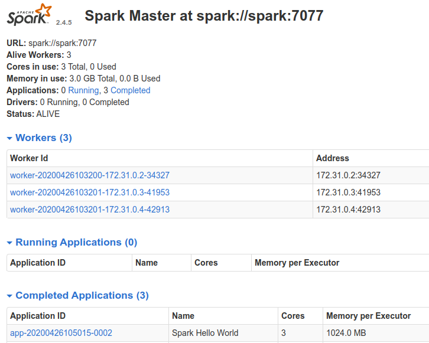

# Airflow Spark

This project contains the following containers:

* postgres: Postgres database for Airflow metadata and a Test database to test whatever you want.
  * Image: postgres:15
  * Database Port: 5433
  * References: https://hub.docker.com/_/postgres

* airflow-webserver: Airflow webserver and Scheduler.
  * Dockerfile: airflow-spark.Dockerfile
  * Port: 8282

* spark: Spark Master.
  * Image: apache/spark-py:v3.4.0
  * Port: 8181
  * References: https://hub.docker.com/r/apache/spark-py

* spark-worker-N: Spark Workers. You can add workers copying the containers and changing the container name inside the docker-compose.yml file.
  * Image: apache/spark-py:v3.4.0
  * References: https://hub.docker.com/r/apache/spark-py

* jupyter-spark: Jupyter notebook with pyspark for interactive development.
  * Image: jupyter/pyspark-notebook:spark-3.4.0
  * Port: 8888
  * References: https://hub.docker.com/r/jupyter/pyspark-notebook

## Architecture Components


## Setup

### Clone project

### Build airflow Docker

Inside the airflow-spark/docker/docker-airflow

```shell
  $ docker build --rm --force-rm -t docker-airflow-spark:2.6.0_3.2.4 .
```

Optionally, you can override the arguments in the build to choose specific Spark, Hadoop and Airflow versions. As an example, here is how to build an image containing Airflow version 2.6.0, Spark version 3.2.4 and Hadoop version 3.2.

```shell
  $ docker build --rm --force-rm \
    -t docker-airflow-spark:2.6.0_3.2.4 . \
    --build-arg AIRFLOW_VERSION=2.6.0 \
    --build-arg SPARK_VERSION=3.2.4 \
    --build arg HADOOP_VERSION=3.2
```

Spark and Hadoop versions follow the versions as defined at Spark download page: https://spark.apache.org/downloads.html

Airflow versions can be found here: https://pypi.org/project/apache-airflow/#history

If you change the name or the tag of the docker image when building, remember to update the name/tag in docker-compose file.

### Start containers

Navigate to airflow-spark and:

```shell
  $ docker compose up
```

If you want run in background:

```shell
  $ docker compose up -d
```

Note: when running the docker-compose for the first time, the images `postgres:15`, `bitnami-spark:3.2.4`, and `jupyter/pyspark-notebook:spark-3.4.0` will be downloaded before the containers started.

### Check if you can access

Airflow: http://localhost:8080

Spark Master: http://localhost:8181

Postgres - Database Test:

* Server: localhost:5433
* Database: test
* User: test
* Password: postgres

Postgres - Database airflow:

* Server: localhost:5433
* Database: airflow
* User: airflow
* Password: airflow

Jupyter Notebook: http://localhost:8888

* For jupyter notebook, you must copy the URL with the token generated when the container is started and paste in your browser. The URL with token can be taken from container logs using:

```shell
  $ docker logs -f jupyter-spark
```

## How to run a DAG to test

1. Configure spark connection accessing airflow web UI http://localhost:8080 and going to Connections


2. Edit the spark_default connection inserting `spark://spark` in Host field and Port `7077`


3. Run the spark-test DAG

4. Check the DAG log for the task spark_job. You will see the result printed in the log


5. Check the spark application in the Spark Master web UI (http://localhost:8181)


## How to run the Spark Apps via spark-submit

After started your docker container, run the command below in your terminal:

```shell
  $ docker exec -it spark-master spark-submit --master spark://spark:7077  <spark_app_path> [optional]<list_of_app_args>
```

Example running the hellow-world.py application:

```shell
  $ docker exec -it spark-master spark-submit --master spark://spark:7077  /usr/local/spark/app/hello-world.py /usr/local/spark/resources/data/airflow.cfg
```

## Increasing the number of Spark Workers

You can increase the number of Spark workers just adding new services based on `bitnami/spark:3.2.4` image to the docker-compose.yml file like following:

```shell
  spark-worker-n:
    image: bitnami/spark:3.2.4
    user: root
    networks:
      - default_net
    environment:
      - SPARK_MODE=worker
      - SPARK_MASTER_URL=spark://spark:7077
      - SPARK_WORKER_MEMORY=1G
      - SPARK_WORKER_CORES=1
      - SPARK_RPC_AUTHENTICATION_ENABLED=no
      - SPARK_RPC_ENCRYPTION_ENABLED=no
      - SPARK_LOCAL_STORAGE_ENCRYPTION_ENABLED=no
      - SPARK_SSL_ENABLED=no
    volumes:
      - ../spark/app:/usr/local/spark/app # Spark scripts folder (Must be the same path in airflow and Spark Cluster)
      - ../spark/resources/data:/usr/local/spark/resources/data #Data folder (Must be the same path in airflow and Spark Cluster)
```

## Adding Airflow Extra packages

Rebuild Dockerfile (in this example, adding GCP extra):

```shell
  $ docker build --rm --build-arg AIRFLOW_DEPS="gcp" -t docker-airflow-spark:2.6.0_3.2.4 .
```

After successfully built, run docker compose to start container:

```shell
  $ docker compose up
```

## Extras

### Spark + Postgres sample

* The DAG `spark-postgres.py` loads `movies.csv` and `ratings.csv` data into Postgres tables and query these tables to generate a list of top 10 movies with more rates.
  * This DAG runs the load-progress.py and read-progress.py applications. These applications are also available in the notebooks `load-postgres-notebook.ipynb` and `read-postgres-notebook.ipynb`.